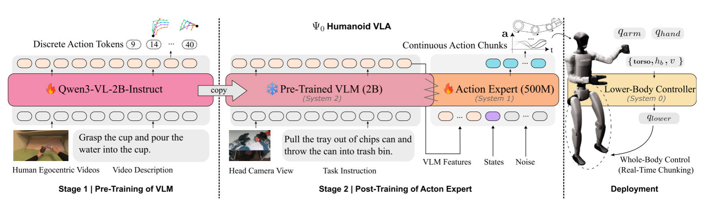
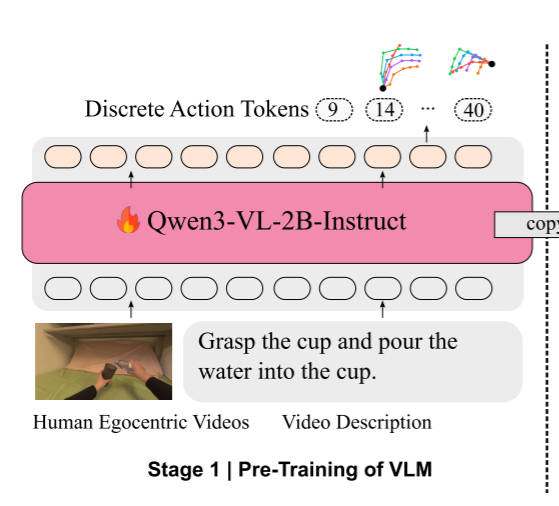
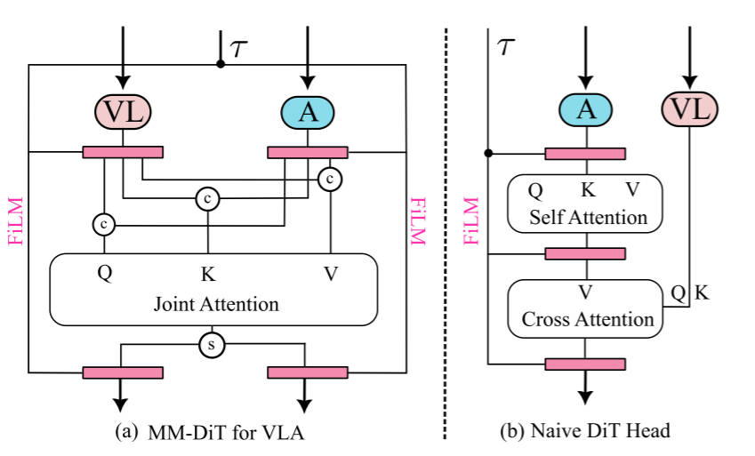

# Ψ 0

项目主页：https://psi-lab.ai/Psi0/

论文：[https://arxiv.org/abs/2603.12263](https://arxiv.org/abs/2603.12263)

数据集：[https://huggingface.co/datasets/USC-PSI-Lab/psi-data/tree/main](https://huggingface.co/datasets/USC-PSI-Lab/psi-data/tree/main)

code：[https://github.com/physical-superintelligence-lab/Psi0](https://github.com/physical-superintelligence-lab/Psi0)

## 行业发展与目标
### 现有方法缺陷
| 类别 | 代表性现象/方法 | 主要劣势 | 本质问题 |
| :---: | --- | --- | --- |
| 异构数据混训 | human + humanoid + non-humanoid 数据一起端到端训练；如论文对 H-RDT 类思路的批评 | 数据效率低，性能不理想 | 模型被迫同时拟合差异很大的 action distribution |
| 偏 locomotion 的 whole-body 方法 | LangWBC, LeVERB | 更擅长导航/移动，对精细操作支持不足 | “会走”不等于“会操作” |
| 偏低层控制的数据采集/控制框架 | AMO, TWIST2 | 强在低层控制，不等于学到长时程操作策略 | 缺少面向 long-horizon dexterous manipulation 的 policy learning |
| 从 human video 学操作的方法 | Being-H0 | 场景范围窄，多为单臂 tabletop manipulation | 不能直接覆盖真实 humanoid loco-manipulation 场景 |
| 大参数量 VLA 推理 | 现有 billions 级 VLA | 推理延迟导致 stop-and-think、chunk 不连续、动作抖动。 | 训练目标没显式考虑 real-time deployment |
| 现有 teleop 数据采集方式 | end-to-end whole-body teleop；低维 gripper teleop；多操作员方案 | 不稳、不灵巧、或不实用 | 难以得到高质量、适合长时程任务的 in-domain 数据 |

### 核心研究问题
**如何有效地从人类第一视角视频中提炼运动先验和世界知识，以实现人形机器人的鲁棒全身控制？**

具体挑战：

1. **数据效率问题**：如何用远少于竞品的数据量达到更好性能？
2. **体态鸿沟问题**：如何跨越人类与机器人的形态差异？
3. **推理延迟问题**：2.5B+ 参数模型推理约需 160ms，如何实现平滑实时控制？
4. **数据采集质量**：如何为 Loco-Manipulation 采集高质量遥操作数据？

### 总体解决思路
**阶段1：预训练（Pre-training）**

+ **数据**：以大规模人类第一视角视频 **EgoDex**（约 829 小时）为主，后段补充真实机器人数据集 **Humanoid Everyday**（约 31 小时）以消除人类与机器人的视觉域差异。
+ **学习内容**：学习语言指令的任务语义、跨任务的动作先验，以及对齐下游真实机器人的视觉表征。
+ **训练目标**：基于统一的人机 48-DoF 任务空间动作（Task-space action，含手腕位姿和指尖位置），利用专门训练的 FAST tokenizer 将连续动作高效离散化（压缩至约 20 个 token）。微调 Qwen3-VL-2B，采用自回归方式仅预测**单步** Next-action token，从而大幅降低多步动作预测的计算开销并提升预训练效率。

**阶段2：后训练（Post-training）**

+ **数据**：高质量跨任务真实人形机器人数据集 **Humanoid Everyday**（约 300 万帧真实遥操作数据）。
+ **学习内容**：学习特定具身（Embodiment-specific）的动力学特性和精确的机器人底层关节控制先验。
+ **训练目标**：完全冻结 VLM 骨干网络，从头训练一个约 500M 参数、基于 MM-DiT 架构的动作专家（Action Expert）。以 VLM 提取的视觉-语言特征为条件，通过流匹配（Flow-matching）目标对连续的 36-DoF 关节空间动作块（Joint-space action chunk）进行直接建模。

**阶段3：任务适配微调（Fine-tuning）**

+ **数据**：少量任务特定的真实遥操作数据（每个任务仅收集 80 条轨迹）。
+ **学习内容**：快速适配特定场景下的复杂、长序列全身移动与灵巧操作任务（Loco-manipulation）。
+ **训练方式**：保持 VLM 冻结，**只微调 action expert**。同时引入训练时实时动作分块机制（Training-time RTC），通过随机掩码掉部分初始动作 token 来模拟真实推理延迟，从而消除真机部署时的“停顿-思考”现象和控制抖动。

## 模型架构设计
### 动作空间定义
!!! note

    $\Psi_0$ 大模型（即 Action Expert / System-1）直接输出的动作空间

    统一表示为 $a \in \mathbb{R}^{36}$，包含：

    - 上肢：$q_{hand} \in \mathbb{R}^{14}$（灵巧手关节）、$q_{arm} \in \mathbb{R}^{14}$（臂部关节）
    - 躯干与移动：躯干姿态（torso rpy）、基座高度（$h_b$）、线速度（$v_x, v_y$）、角速度（$v_{yaw}$）、目标偏航（$p_{yaw}$）

大模型输出的那 8-DoF 下半身指令，会直接塞给底层的一个 RL 跟踪策略（System-0，使用的是 AMO 控制器）。这个底层控制器会把这 8 个高维指令，**映射**为具体的 **15-DoF 下半身关节角度**（包括 3 个腰部关节和 12 个腿部关节）。因此，上半身直接输出的 28-DoF 加上底层控制器转译出的 15-DoF，最终构成了发给电机执行的 **43-DoF 全身控制指令**。

| **分量** | **维度** | **描述** |
| :---: | :---: | :---: |
| q_hand | 14-DoF | 双手关节角 |
| q_arm | 14-DoF | 双臂关节角 |
| torso_rpy | 3-DoF | 躯干横滚/俯仰/偏航 |
| h_b | 1-DoF | 基座高度 |
| v_x, v_y | 2-DoF | 水平线速度 |
| v_yaw | 1-DoF | 偏航角速度 |
| p_yaw | 1-DoF | 目标偏航旋转 |
| 合计（高层策略输出） | 36-DoF | **VLA 输出** |
| 下肢跟踪（System-0 输出） | 15-DoF | **RL 控制器扩展** |
| 全身合计 | 43-DoF | **实际关节控制** |

### 模型结构
<!-- 这是一张图片，ocr 内容为： -->

#### VLM Pre Train
**VLM主干（系统2）**：基于 **Qwen3-VL-2B-Instruct**，处理每帧图像与语言指令，输出视觉-语言特征序列。**预训练阶段**自回归预测离散化动作 token。

<!-- 这是一张图片，ocr 内容为： -->
{ width="400" }

**作者选的是一个任务空间 hand-centric 表示，而不是关节空间 Joint 等**

1. 9 维 wrist pose：xyz + 6DoF 位姿
2. 5 个指尖的位置，每个指尖 3 维，共 15 维

所以合起来每只手 24 维，双手共 48 维。然后这个 `(1, 48)` 的连续向量归一化后使用 `Fast-Tokenizer`，输出一段对应词表中的 `token id`：`[123, 98, 1776, 42, 901, ...]`。然后转成字符串形式：`<|a_123|><|a_98|><|a_1776|><|a_42|><|a_901|>...`，约 20 个左右。代码里面默认学习 **relative delta**，每次都只推一个，`chunk size = 1`，forward 之后对输出的 latent action 计算 cross-entropy。

**注意，这里是没有 co-train，先训 EgoDex，再训 Humanoid Everyday。**

#### FM+Action Expert
`图像 + 指令 + 当前状态 -> 一段 joint-space action chunk（36DoF）`

Stage 2 的后训练数据主要来自 `Humanoid Everyday`，和其余 VLA 的 flow matching 一模一样，有几个问题解决即可：

1. flow matching 时间变量 t 或 sigma 是直接均匀采样的，不像 groot 或者 π 使用 β 采样。
2. 训练器里做验证/离线 inference 时 `eval_diffusion_steps = 10`，真实部署 RTC 服务器里 `num_inference_steps = 8`。
3. 这里使用了一个 `action_mask` 用来区分 episode 边界。

当先根据当前 `frame_id` 构造未来动作索引，需要取一段 future action chunk，但如果当前帧已经靠近 episode 尾部，未来可能不够长。本来想取 `[97, 98, 99, 100, 101]` chunks，但这个 episode 只有到 99，那实际取出来会变成：`[97, 98, 99, 99, 99]`，`action_mask` 是 `[1, 1, 1, 0, 0]`。

<!-- 这是一张图片，ocr 内容为： -->
{ width="500" }

!!! tip

    红色层是时间 t 融入层。

    优势：

    1. **融合更早**
    不是最后加一个 cross-attention，而是每层都联合交互。
    2. **融合更对称**
    不是只有动作读视觉语言，视觉语言分支也参与共同更新。
    3. **融合更细粒度**
    是 token-level joint attention，不是先压成一个全局条件向量再喂给动作头。

!!! question "Q：预训练输出的 token 是 latent eef，但是后训练学的是 joint，这不是很大的一个 gap？"

!!! question "Q：Stage 2 的后训练数据主要来自 Humanoid Everyday。但 HE 原始数据本身不完整覆盖下肢高层控制信号，这里是怎么解决的？"

    这块代码思路很直接，不是“补估计一个下肢信号模型”，而是把 HE 里真实存在的上肢/手部 joint 数据整理好，然后把缺失的 lower-body 控制维度直接 pad 到 36 维，同时用 mask 告诉训练哪些维度是真实的，哪些是补零占位的。

    **第一步：先把 HE 原始 joint 数据统一成上肢 28 维**

    在 `transform.py` 的 `HEPosttrainRepackTransform` 里，先判断机器人类型：

    - 如果 `action.joint_angles.shape[1] == 26`，说明是 `H1 + Inspire hand`
    - 否则按 G1 的格式走

    对 H1，它会做一次**关节重排和补指关节维度**：

    - 左手 6 维 -> 补成 7 维
    - 右手 6 维 -> 补成 7 维
    - 再拼接双臂 14 维

    最后得到：

    - 手：14 维
    - 臂：14 维
    - 合计：**28 维**

    也就是说，先把 G1 Dex3-1 和 H1 Inspire 对齐到同一个“手14 + 臂14”的 joint 空间。

    **第二步：把动作改成 delta，并继承原始有效位 mask**

    如果配置开了 `use_delta_actions`，代码会做：

    - `actions = actions[1:] - actions[:-1]`
    - `action_mask = data["action_mask"][1:]`

    也就是后训练学的也是 delta joint action，不是绝对 `joint angle`。然后如果原始 `action_mask` 是一维时间掩码，就会扩成 `(T, Da)`，让每个动作维度都带 mask。

    **第三步：把 28 维 action/state pad 到 36 维**

    这是关键，在同一个 repack 里有：

    - `pad_state_dim=36`
    - `pad_action_dim=36`

    训练脚本 `posttrain-he-psi0.sh` 里明确传了这两个参数。

    于是 repack 会调用 `pad_to_len(...)`：

    - `states`：从 28 维 pad 到 36 维
    - `actions`：从 28 维 pad 到 36 维
    - `mask`：也一起 pad 到 36 维

    这多出来的 8 维，对应的正是论文里说的 lower-body 高层控制信号槽位：

    - `torso rpy`: 3
    - `base height`: 1
    - `vx, vy, vyaw, target_yaw`: 4

    **HE 后训练阶段，这 8 维根本没有真实监督值，直接补零占位。**

#### Fine-Tuning on In-domain Teleoperation Data
1. 用真实遥操数据 SFT
2. 36 维动作完整

!!! info "实时动作分块（RTC）"

    stop-think-execute 问题是机器人会出现停顿，而且相邻两个动作块之间容易不连续，表现成 pause、jitter、动作发抖，长任务里失败率会更高。

    **下一段 action chunk 不是从头随便生成，而是强制它的前缀和当前还没执行完的上一段动作保持连续。**

    _**训练时候：**_

    **第一步：随机采样一个 delay**

    - 训练时随机取一个推理延迟 d，表示当前 chunk 的前 d 个时间步，假设已经被前一段动作占用了。

    **第二步：把前 d 个 action token 设成 clean**

    - 在 flow matching 的 noisy action 里，前 d 个时间步不加噪声，保持 clean，后面的时间步正常加噪。
    - 所以模型输入看到的是一种混合状态：前缀是“已确定动作”，后缀是“待生成动作”。

    **第三步：loss 不算前缀，只算后缀**

    - 因为前缀已经被视为 committed actions，所以训练时把前缀 mask 掉，不对它算损失。

    _**推理时候：**_

    - control loop 按固定频率执行当前 chunk 中的动作。
    - inference loop 在当前 chunk 还没执行完时，就提前开始推理下一段 chunk。此时会把当前 chunk 还没执行完的剩余部分作为 `prev_actions` 前缀喂给模型。

### 训练数据配比
上文 1.3 说过，这里详细说一下。

+ **预训练数据**：**EgoDex**（829 小时）高质量自我中心人类操作视频，涵盖多样化灵巧手任务；**Humanoid Everyday**（31 小时）真实人形机器人数据，用于初步对齐。

!!! note

    **EgoDex 本质上是人类第一视角操作视频数据。**

    - 头戴相机视角图像
    - 人手/手腕运动
    - 任务描述
    - 通过预处理得到的手部操作轨迹

    **Humanoid Everyday 本质上是 humanoid 机器人真实执行数据。**

    **它原始信息更接近：**

    - 机器人头部相机图像
    - 机器人上肢/手部状态
    - 机器人动作
    - 任务文本

+ **后训练数据**：**Humanoid Everyday** 全部数据，训练动作专家学习精确关节控制。
+ **微调数据**：每个任务约 **80 条**高质量遥操作轨迹，极少量数据实现快速适应。共 8 个任务。
+ **关键洞察**：**数据质量优于数量**。EgoDex 经过严格筛选，避免互联网噪声；Humanoid Everyday 为真实世界人形轨迹，分布匹配下游任务。
